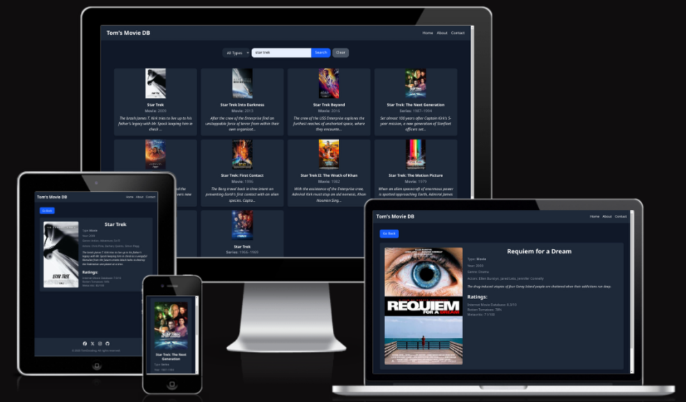

# Tom's Movie Database



[Live Demo](https://tom-movie-db.netlify.app/)

## Overview 

A simple React-based Movie and TV Database app with search functionalities. A go-to app for cinephiles.
It uses Tailwind CSS for styling and the [OMDb API](https://www.omdbapi.com/) for movie data.


## Features

- **Search Bar** - Search for movies, TV series, and episodes by title. The search bar supports pagination and filtering by type (movie, series, episode).
- **Movie Details** - View detailed information about a selected movie, including title, year, genre, plot, actors, and ratings.
- **Responsive Design** - The application is fully responsive, ensuring a seamless experience across devices.
- **Pagination** - Navigate through search results with a user-friendly pagination system.
- **Type Filtering** - Filter search results by type (movie, series, episode) to narrow down your search.
- **Error Handling** - Display user-friendly error messages for API failures or no results found.

## Technology Stack

- **Frontend Framework:** [React.js](https://reactjs.org/)
- **Styling:** [Tailwind CSS](https://tailwindcss.com/)
- **API:** [The Open Movie Database API (OMDb)](https://www.omdbapi.com/) -  A RESTful web service to obtain movie, TV series, and episode information.
- **Routing:** [React Router](https://reactrouter.com/)
- **Deployment:** [Netlify](https://www.netlify.com/) - A cloud platform for automated deployment and hosting of web applications.
- **Favicon:** [Favicon IO](https://favicon.io/) - A favicon generator app.
## Installation and Setup

1. **Clone the repository:**

   ```bash
   git clone https://github.com/tomdu3/movie-app.git
   ```

2. **Navigate to the project directory:**

   ```bash
   cd movie-app
   ```

3. **Install dependencies:**

   ```bash
   npm install
   ```

4. **Set up environment variables:**

   Create a `.env` file in the root directory and add your OMDb API key:

   ```bash
   VITE_OMDB_API_KEY=your_api_key_here
   ```

5. **Start the development server:**

   ```bash
   npm run dev
   ```

6. **Open the application in your browser:**

   The application should be running at `http://localhost:5173/`.

## Directory Structure

```
.
├── docs
├── public
│   └── favicon_io
└── src
    ├── assets
    ├── components
    │   ├── Footer.jsx
    │   ├── MovieDetails.jsx
    │   ├── Navbar.jsx
    │   └── Search.jsx
    ├── services
    │   └── api.js
    ├── App.css
    ├── App.jsx
    └── main.jsx
```

- `./src/components`: Contains reusable React components (Navbar, Footer, Search, MovieDetails).
- `./src/services`: Contains API service functions for interacting with the OMDb API.
- `./public/favicon_io/`: Contains images and details for the favicon in the application.
- `./src/App.jsx`: Main application component.
- `./src/main.jsx`: Entry point of the application.

## Key Components

### Search Component

The `Search.jsx` component handles the search functionality. It allows users to search for movies, TV series, and episodes by title. The component supports pagination and filtering by type (movie, series, episode). It also fetches additional details like the plot for each movie in the search results.

### MovieDetails Component

The `MovieDetails.jsx` component displays detailed information about a selected movie/TV series, including title, year, genre, plot, actors, and ratings. It also includes a "Go Back" button to return to the previous search results.

### Navbar Component

The `Navbar.jsx` component provides navigation links for the application, including links to the home page, about page, and contact page.

### Footer Component

The `Footer.jsx` component displays social media links and a copyright notice.

## Future Enhancements

- **Advanced Filtering and Search:** Implement more advanced filtering options, such as filtering by year, genre, or rating.
- **User Authentication:** Implement user accounts and authentication to allow users to save their favorite movies.
- **Watchlist:** Allow users to create and manage a watchlist of movies they want to watch.
- **Improved Error Handling:** Implement more comprehensive error handling for API requests and other potential issues.
- **Advanced State Management:** Transition to a more robust state management solution ([Redux](https://redux.js.org/), [Zustand](https://github.com/pmndrs/zustand), or [Jotai](https://github.com/pmndrs/jotai)) for larger applications.
- **Unit and Integration Testing:** Add comprehensive tests for application logic.
- **Deployment Optimization:** Optimize the application for faster loading times and improved performance.

## License

This project is licensed under the MIT License - see the [LICENSE](./LICENSE) file for details.

## Copyright

Copyright © 2025 [TomDcoding]. All rights reserved.